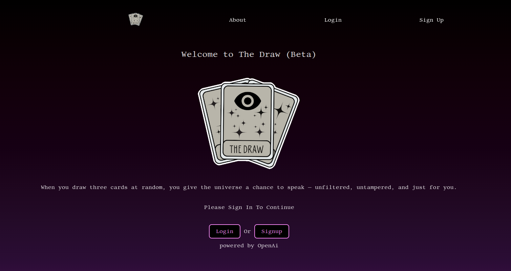
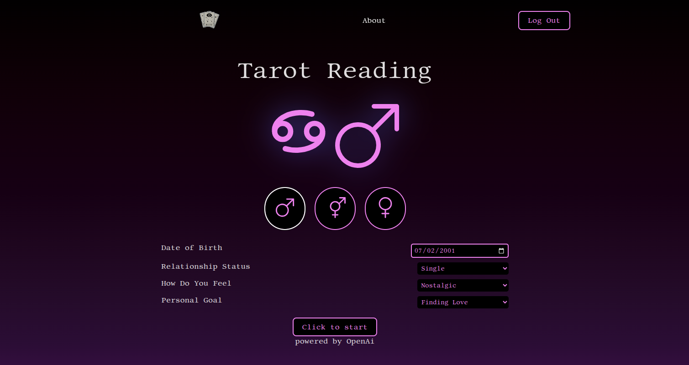
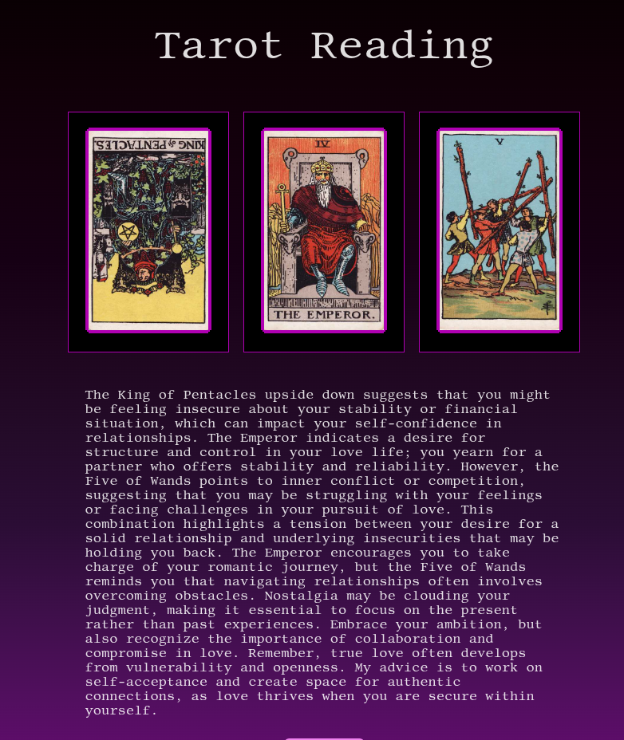

# The Draw

## Overview
A modern tarot card reading web app that offers intuitive 3-card readings powered by OpenAI. Users can ask spiritual or introspective questions, receive symbolic interpretations, and explore personal insights — all wrapped in a mysterious, neon-tinged aesthetic.

## Features
- 🔮 Three-card tarot readings based on user input
- ✨ Card flip animations with custom styles
- 💬 AI-generated interpretations using OpenAI
- 📱 Mobile-friendly design
- 🧑‍💻 User authentication (sign up/login)

## Deployment
- **[Deployed App (Currently In Beta)](https://thedraw.netlify.app/)**
- **[Back-end Repo](https://github.com/Erodri6z/the-draw-backend)**

## Technologies and Tools Used
### Frameworks 
- **MongoDB** 
- **Express.js** 
- **React.js**
- **Node.js**

### Tools For Planning
- **Canva** - for logo design.
- **Whimsical** - for wireframing.
- **Trello** - for project managment.
- **Notion** - for project notes.
- **Bootstrap** - for icons.
- **ColorSpace** - for gradient/color pallet.
- **Google Fonts** - for fonts.

### APIs and Databases
- **Cloudinary** - for image storage.
- **MongoDB Atlas** - for storing user profiles and session data.
- **OpenAi** - for generating tarot interpretations using GPT.

### Deployment 
- **Netlify** - Front end
- **Fly.io** - Back end 

## IceBox
- [ ] Customizable tarot spreads (Celtic Cross, One Card, etc.)
- [ ] Better Interface for readings
- [ ] Share Via Social Media
- [ ] Add new Top Secret Features

